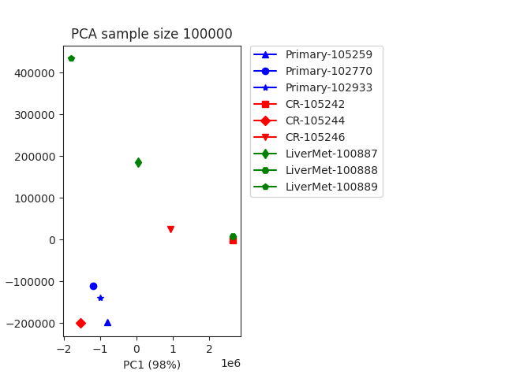

# PCA Generator
## Author: Brian Palmer
## 10/10/21


```bash
./pca.sh --help
```

```
usage: pca.sh [-m, --metafile] [-i, --input-directory] [-o, --output-directory] [-s, --sample-size]
```

The metafile contains the filenames, their group, and the folder they are located in:
```bash
touch metafile.csv

echo 105259,Primary,original_primary_files >> metafile.csv
echo 102770,Primary,original_primary_files >> metafile.csv
echo 102933,Primary,original_primary_files >> metafile.csv
echo 100887,LiverMet,original_LM_files >> metafile.csv
echo 100888,LiverMet,original_LM_files >> metafile.csv
echo 100889,LiverMet,original_LM_files >> metafile.csv
```

The rest of the parameters are explained below:
```
--input-directory	The input directory is the parent directory where the folders above live.
--output-directory	Directory where pca plot will be saved.
--sample-size		Sample size to use for PCA. 
```

### Output

</br>
**Figure 1.** Principle Component Analysis (PCA) from original week1 data. 
