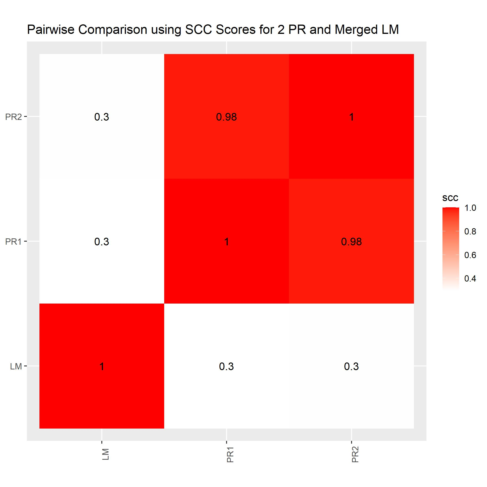
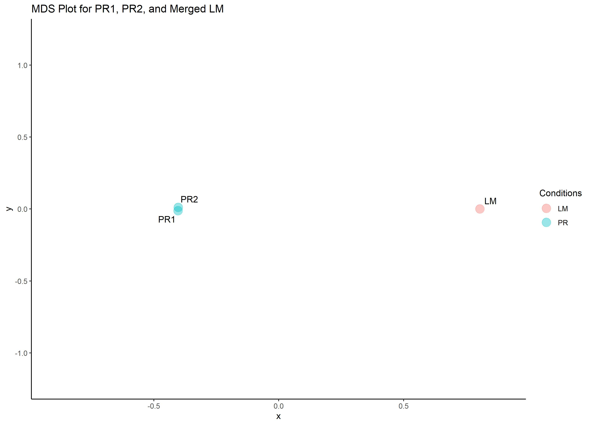
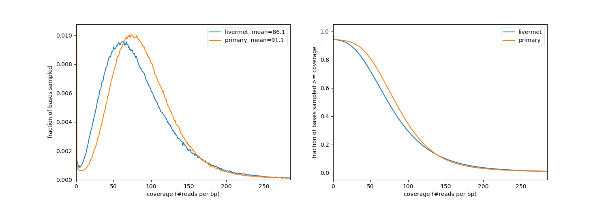

# Post Merge Analysis

## SCC Analysis and MDS

We repeated the SCC analysis using the script in `02_visualize_replicates/StratumAdjustedCorrelationCoefficients`. 

The generated primary sub samples are very similar to each other. Additionally, livermet and primary have lower scores when compared with each other.

We used the same script from `02_visualize_replicates/MDS` to create this plot. The non linear dimensionality reduction shows distance between replicates in the two samples. We are able to visually classify the two samples by drawing a line between the replicates. 

## Read Depth

The primary sample shows slightly better read coverage than our liver metastasis sample. The plot on the left shows that in the first one percent of the bases that were sampled had a coverage of 96. The plot on the right shows the percent of the genome with read length definied by values on the X axis. These plots are made by sampling one million base pairs and finding their overlapping regions.