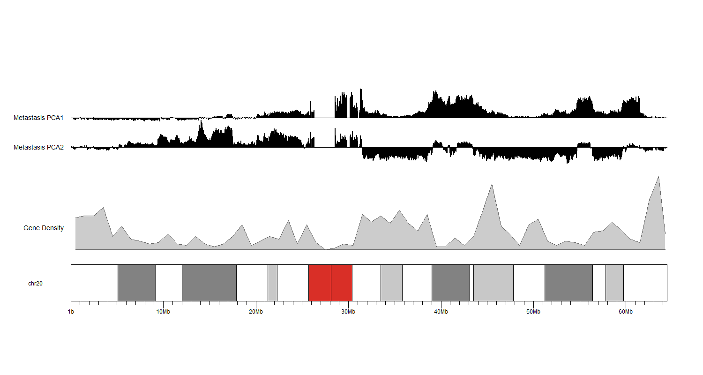
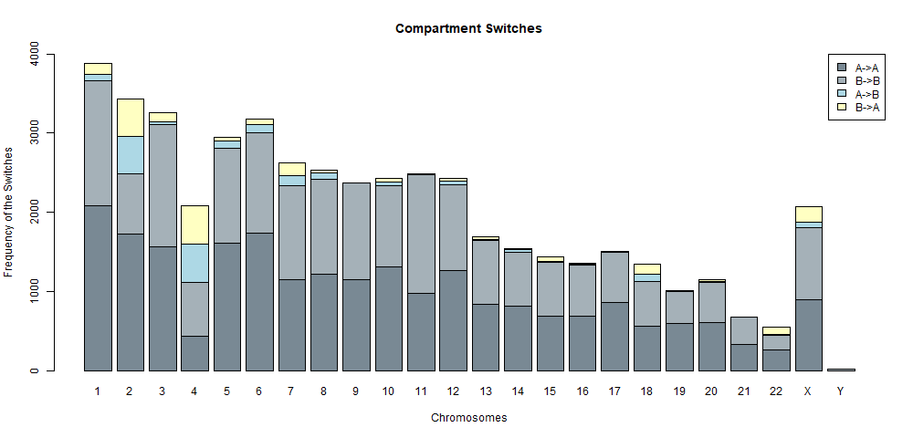
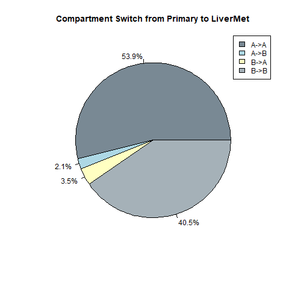

# AB Compartment Analysis

A and B comparments are also referred as open and closed compartments, respectively. An open compartment generally has less tightly bound chromatin allowing for greater gene expression, where the opposite is true for closed compartments. When looking at a HIC matrix, the checker board pattern can implicitly be mapped to open and closed compartments. 

Follow the [README for Homer](https://github.com/dozmorovlab/UO_project_2021/tree/main/06_ab_compartments/diff_analysis_compartmental_switches/homer) to generate bedgraph used for plotting.

Then, feed the bedgraph files into [find_compartments](https://github.com/dozmorovlab/UO_project_2021/tree/main/06_ab_compartments/find_compartments) to generate plots of AB compartments.

Below are our results:

## Find Compartments

In this work, we attempt to identify open and closed comparments. There are a few ways to do this, but we decided to use principle component analysis and rely on gene density to determine if the positive eigenvalues correlated with open or closed compartments. 

The figure above shows two components for liver metastasis on chromosome 20 and with gene density. The second component seems to follow the gene density curve more closely, so positive and negative values should be more indicative open and closed compartments. 

## Differential Analysis of Comparmental Switches

A hallmark of cancer progression is the structural modifications of chromosomes. There is a possibility that a previously closed compartment could open up in later stages of cancer development, and vice versa. Below shows the results of our samples:

We see a shift in AB compartments in later stages (see B -> A, A -> B)

