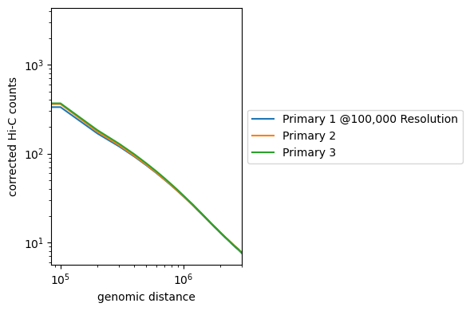
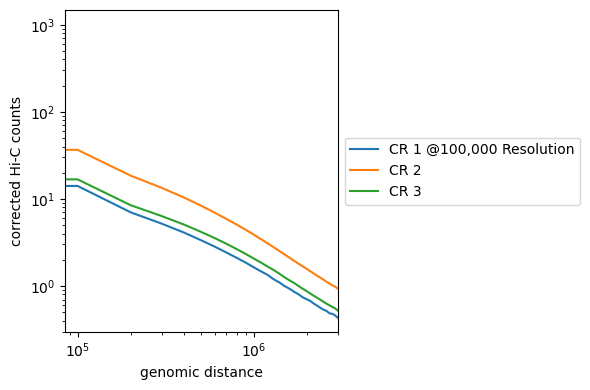
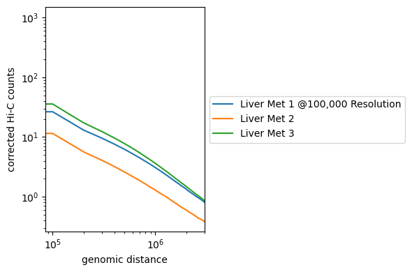

## Distance-Decay Plots
\
We use distance decay plots to visualize interaction counts in terms of distance between genes. As distance increases, it is expected the number of interaction counts will decrease. This is because genes closer in proximity to one another in coordinate space are more likely to interact with each other than ones that are further apart.
\
To check the quality of the biological replicates, use `HiCExplorer 3.0` to create distance-decay plots. The plots should look near-identical for biological replicates.
\
\
First, create the appropriate environment by saving the file [environment.yml](./environment.yml), then run commands:
\
```conda env create -f environment.yml```
\
```conda activate hicexplorer```
\
\
\
If you have `.hic` files, you will need to convert them to `.cool` files through HiCExplorer's [hicConvertFormat](./scripts/cool_converter.sh) function. 
- Input: files with format `<name>.hic`.
- Output: files will be `<name>_resolution_<resolution>.cool` with the specified resolution in specified directory.

\
\
Then, use the resulting `.cool` files with HiCExplorer's [hicPlotDistVsCounts](./scripts/hicPlotDistVsCounts.sh) function.
- Input: files with format `<name>.cool`.
- Output: distance decay plots.
\
\
Example output is below for carboplatin resistant, liver metastatic, and primary tumors.
\



\
\
\
\
*note: to improve this directory, specifically the scripts, the file structure arguments still need to be generalized (e.g. replace <input filename> with some commands).*

