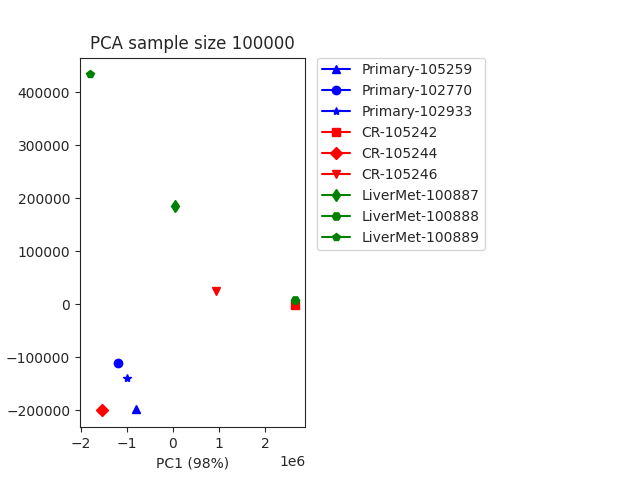

# PCA Generator
## Author: Brian Palmer
## 10/10/21


### Setup
```bash
python3 -m venv venv
````
On OSX/Linux
```bash
source venv/bin/activate
```

On Windows
```bash
venv/Scripts/activate.bat
```

### Usage
```bash
./pca.sh [-m, --metafile] [-i, --input-directory] [-o, --output-directory] [-f, --force]
```

### Output

</br>
**Figure 1.** Principle Component Analysis (PCA) from week1 hic data.
