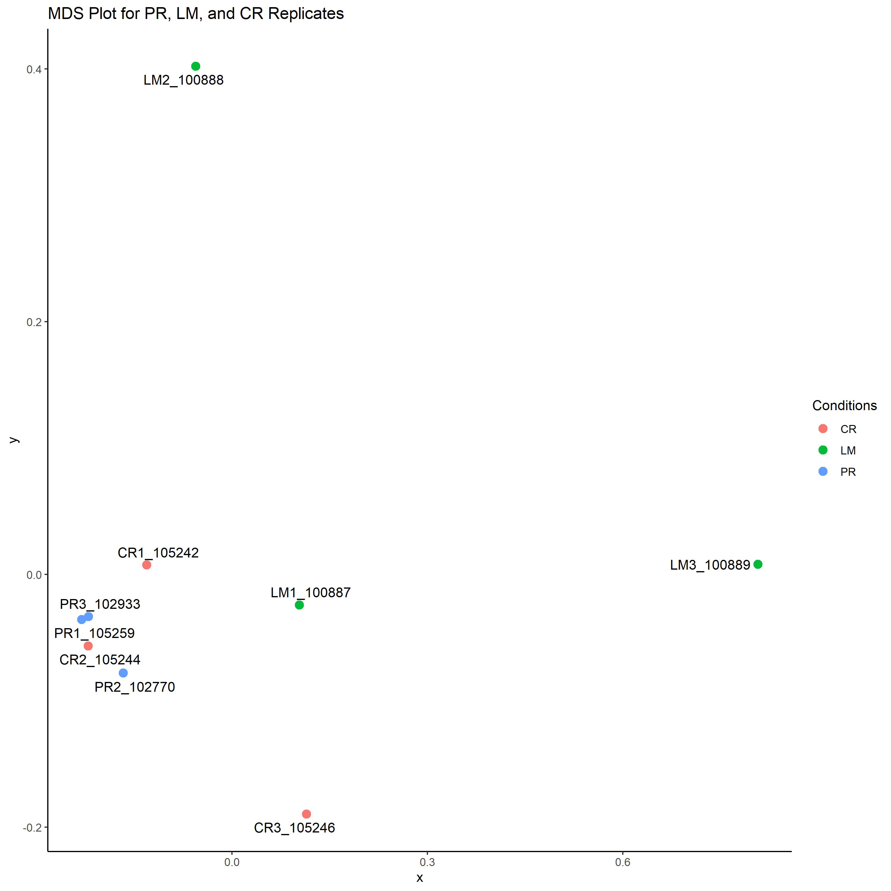
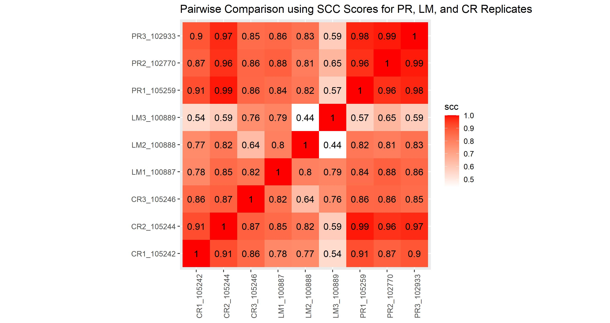
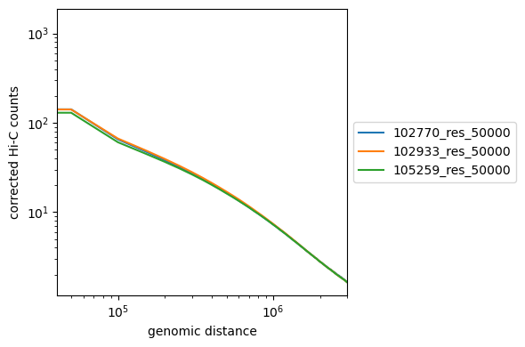
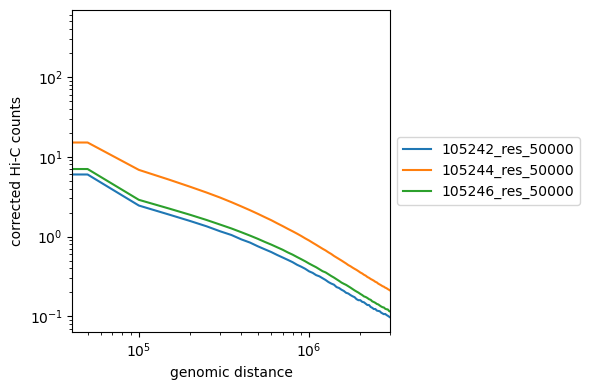
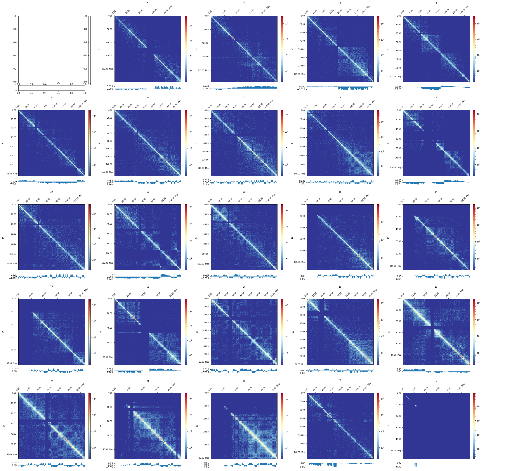
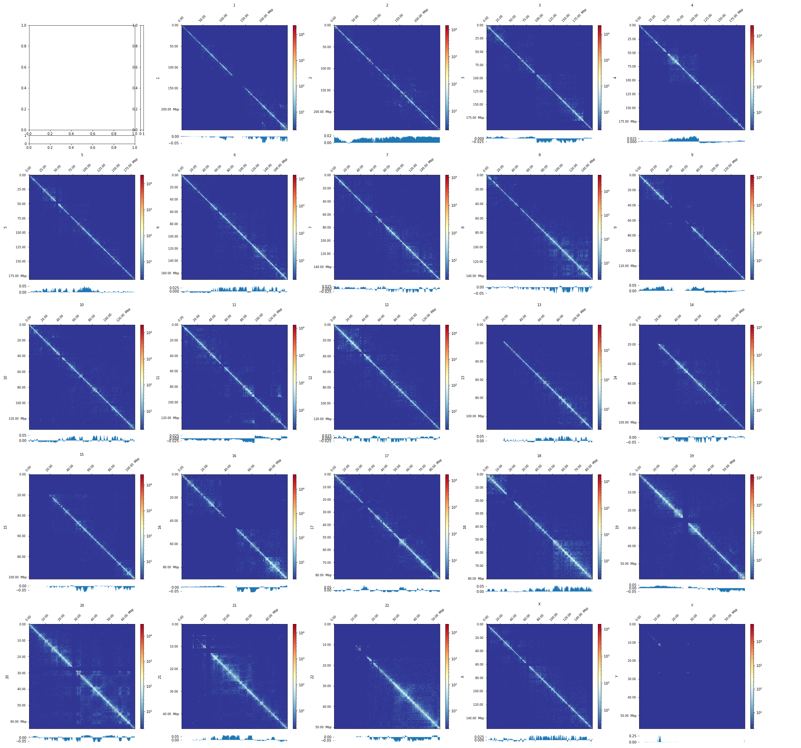
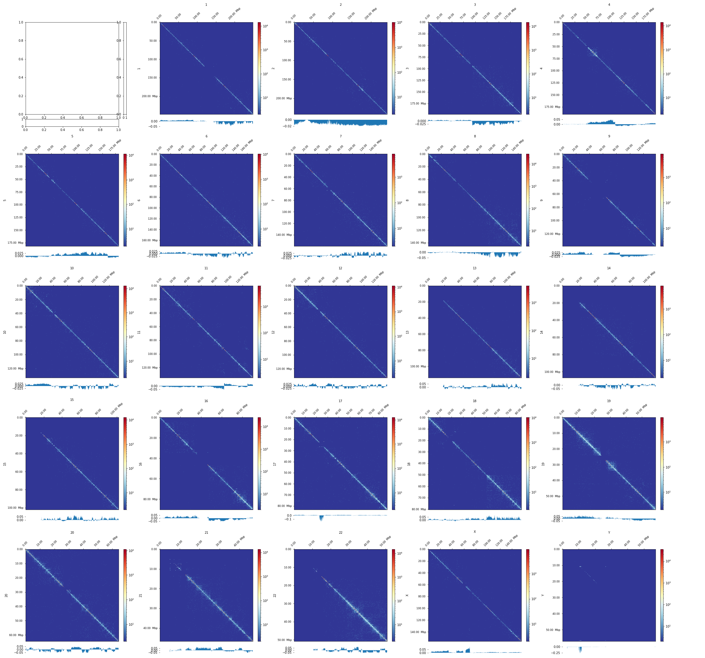
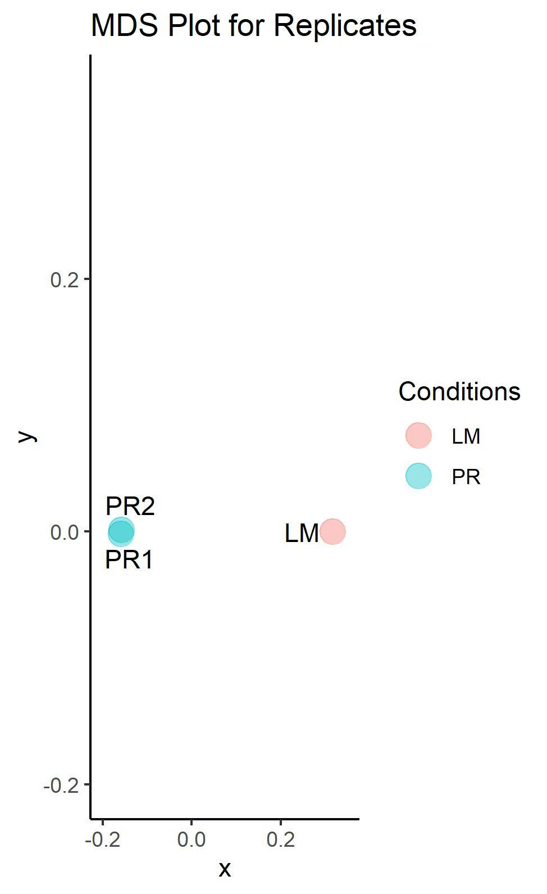
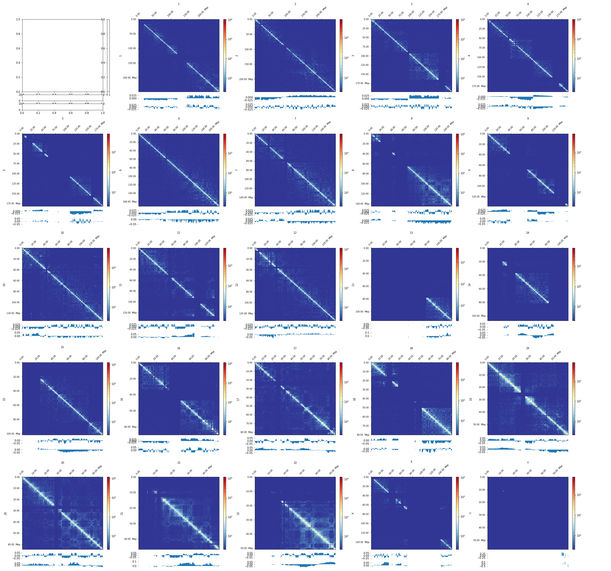
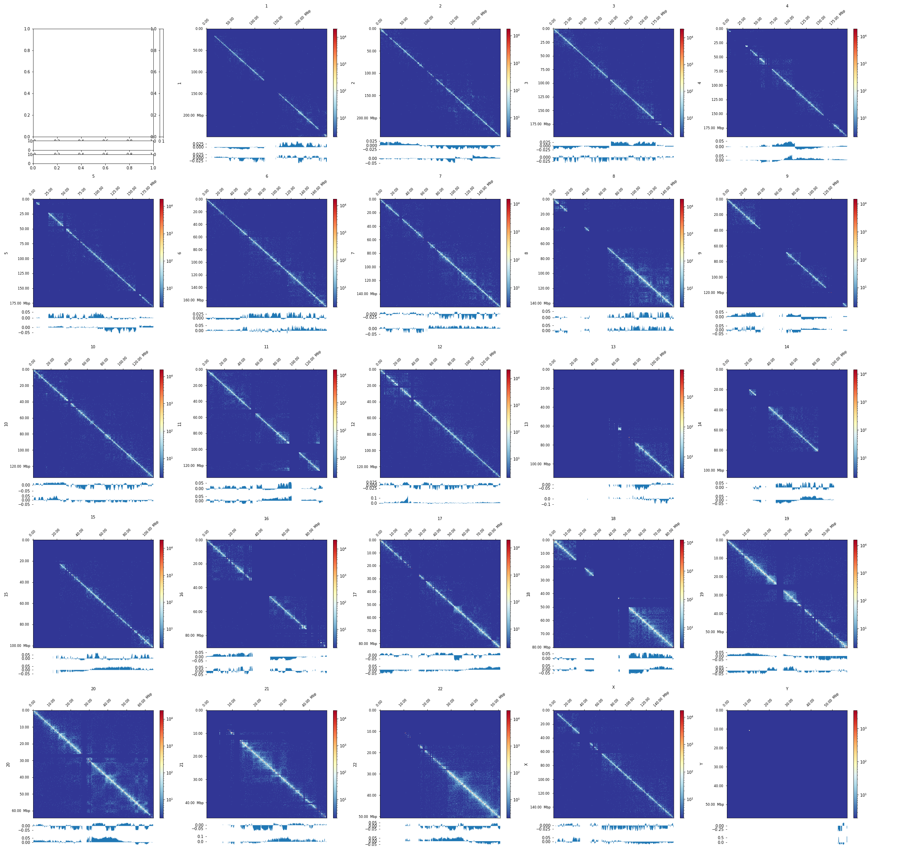

Nov_9_pres
========================================================
author: Jonathan Ogata, Brian Palmer, Juyoung Lee
date: Nov 9, 2021
autosize: true

Intro
========================================================

Three experiments with three biological replicates each.

- Primary Cancer (102770, 102933, 105259)
- Liver Metastatic Cancer (LM) (100887, 100888, 100889)
- Carboplatin Resistant Cancer (CR) (105242, 105244, 105246)

Quality Control
==================
First, we need to examine the quality of our data.
This is done by:
- Principle Component Analysis
- Multidimensional Scaling
- Distance Decay

Principle Component Analysis (PCA)
========================================================

(need method of obtaining PCA plot)

According to the PCA plot above:
- All three primaries are similar, so we keep all of them.
- CR sample 105242 is dissimilar to other two; propose discarding 105244.
- LM sample 100889 is dissimilar to other two; propose discarding 100889.

Multidimensional Scaling (MDS)
====================================

(need method of obtaining MDS plot)

To support our suspicion about the dissimilar CR and LM sample, we create an MDS plot. 

We can see that, indeed, samples 105244 and 100889 are very dissimilar to their counterparts.

<!-- Stratum-adjusted Correlation Coefficients (SCC) -->
<!-- ================================== -->
<!--  -->

<!-- (need method of obtaining SCC plot) -->

Distance Decay
=============================
 

The plots above show the expected interactions as a function of genomic distance.

We expect each of the three biological replicates to be similar in shape and magnitude, however, we can see that once again samples 105244 and 100889 are dissimilar from the counterparts.

Removing Replicates and Merging
============================
As supported by PCA, MDS, and distance decay plots, we removed samples 105242 and 100889 from our data.

Moving forward, we merged the remaining replicates with their counterparts.

(merging method here)

This resulted in the following merged files:

- primary = 102770 + 102933 + 105259
- LM = 100887 + 100888
- CR = 105242 + 105246

Visualizing Primary Merged Replicates
==========================
Using HiCExplorer pipeline, an interaction matrix for each chromosome of the merged primary file was created:

This merged file has the most signal of the three experiments, as we shall soon see...

Visualizing LM Merged Replicates
==========================
Using HiCExplorer pipeline, an interaction matrix for each chromosome of the merged liver metastasis file was created:

Visualizing CR Merged Replicates
==========================
Using HiCExplorer pipeline, an interaction matrix for each chromosome of the merged carboplatin resistant file was created:

This is by far the most under-represented experiment, and so we chose to remove these data entirely.

Moving Forward with Primary and LM
================================
Upon comparison of file sizes, we discovered that the merged primary file was roughly twice the size of the LM file (383G and ___, respectively).

To make the files a comparable size, we split the primary file into seven chunks, then for each chunk:
- shuffle the chunk
- write the first half to `primary_half_1`
- write the second half to `primary_half_2`

This way, each of the new `primary_half` files are homogeneous and are comparable in size to the liver metastasis file.

PCA with New Primary/LM
===============================
To ensure that the new primary halves are homogeneous, we perform another principle component analysis:

Indeed, the two points are nearly indistinguishable. 

Hic Visualization Primary Half 1
============================
Here, we use a HiCexplorer pipe to visualize the first primary half hic matrix:

Hic Visualization Primary Half 2
============================
Here, we use a HiCexplorer pipe to visualize the second primary half hic matrix:

Hic Visualization Liver Metastasis
============================
Here, we use a HiCexplorer pipe to visualize the merged liver metastasis hic matrix:

Next Steps
===========================
Next, we plan on:
- Assigning A/B compartments to eigenvector signs
- Performing differential A/B analysis
- Finding TADs
- Performing differential TAD analysis

